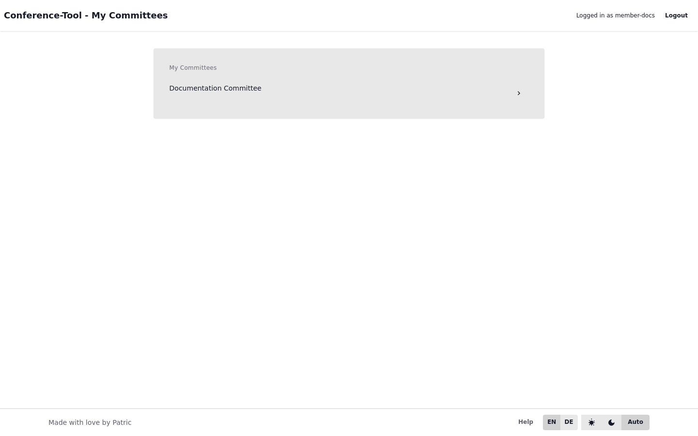

# Erste Schritte

Dieser Abschnitt erklärt die grundlegende Navigation und das Authentifizierungsmodell.

## Seiten

- [Zugriff und Rollen](/docs/01-getting-started/01-access-and-roles)
- [Login- und Sitzungsmodell](/docs/01-getting-started/02-login-and-session-model)
- [Hilfe, Suche und Dokumentnavigation](/docs/01-getting-started/03-help-search-and-doc-navigation)
