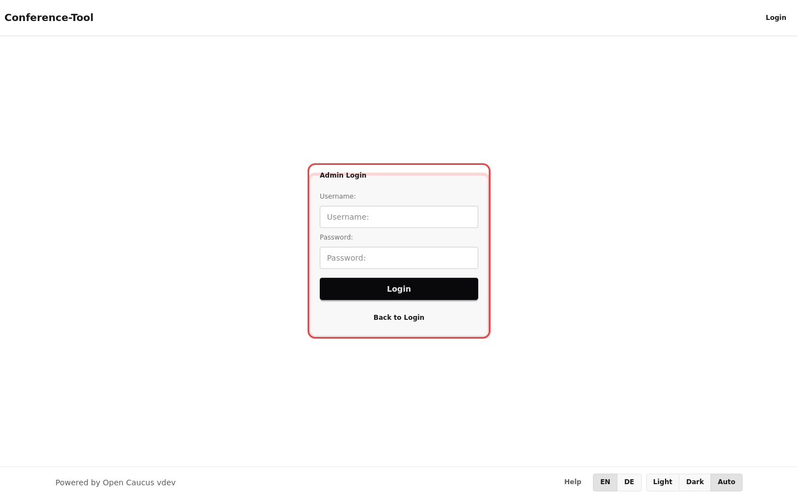

# Admin-Login und Dashboard

Auf dieser Seite öffnest du den Admin-Bereich und stellst sicher, dass du für Admin-Aufgaben bereit bist.

## Für wen diese Seite gedacht ist

Nutzende mit einem Admin-Account, die Gremien, Accounts und Plattformrichtlinien verwalten.

## Bevor du loslegst

1. Stelle sicher, dass du über Admin-Zugangsdaten verfügst.
2. Überprüfe, dass kein anderer Nicht-Admin-Account in demselben Browser angemeldet ist.
3. Falls die Passwortanmeldung in deiner Konfiguration deaktiviert ist, kläre, welche Admin-Anmeldemethode du verwenden sollst.

## Schritt für Schritt

1. Öffne die Admin-Loginseite. Das Formular wird als zentrierte Karte angezeigt, passend zum Design der regulären Loginseite.
2. Melde dich mit der verfügbaren Methode an:
   - Passwortanmeldung: Gib Benutzername/Passwort ein und klicke auf **Login**.
   - Single-Sign-on-Anmeldung: Klicke auf **Login with OAuth**.
   - Falls du die Admin-Loginseite versehentlich geöffnet hast, klicke auf **Zurück zur Anmeldung**, um zur regulären Loginseite zurückzukehren.
3. Überprüfe, dass du zum Admin-Dashboard weitergeleitet wirst.
4. Prüfe die Dashboard-Zusammenfassungen (Gremien und Accounts), um sicherzustellen, dass alles korrekt aussieht.
5. Nutze die Dashboard-Aktionen für den nächsten Schritt:
   - Klicke auf **Manage Accounts**, um die Accountverwaltung zu öffnen.
   - Klicke auf **Assign Accounts** in einer Gremiumszeile, um Mitgliedschaften zu verwalten.
   - Nutze **Create Committee**, um ein neues Gremium anzulegen.

## Was du sehen solltest

- Nach erfolgreicher Admin-Anmeldung landest du im Dashboard, nicht auf einer normalen Nutzerseite.
- Das Dashboard zeigt die Gremiumsverwaltung sowie direkte Links zu Account- und Mitgliedschaftsaufgaben.
- Admin-spezifische Steuerelemente sind nur in diesem Bereich sichtbar.

## Falls etwas schiefgeht

- Anmeldung wird abgelehnt:
  Überprüfe Benutzername/Passwort und versuche es erneut.
- Du landest in einem Nicht-Admin-Bereich:
  Melde dich ab und logge dich mit einem Admin-Account ein.
- Du erhältst eine Zugriffsverweigerung beim Öffnen von Admin-Seiten:
  Das angemeldete Konto hat keine Admin-Berechtigung.
- Passwortanmeldung ist nicht verfügbar:
  Die Passwortanmeldung ist möglicherweise in deiner Konfiguration deaktiviert; nutze die Admin-Anmeldemethode, die dein Team eingerichtet hat.

## Wie es weitergeht

Weiter mit [Accounts und Gremiumsverwaltung](/docs/02-admin/02-accounts-and-committee-management) für Erstell- und Aktualisierungsvorgänge.
