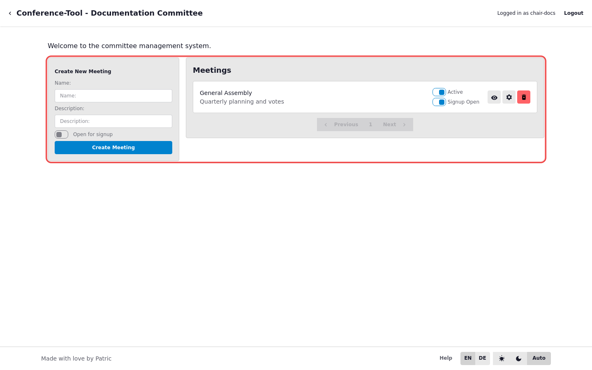

# Committee Dashboard and Meeting Lifecycle

Use the committee dashboard to prepare and control the meeting lifecycle.

## Standard Sequence

1. Create the meeting with a clear name and short purpose.
2. Mark exactly one meeting as active when people should join.
3. Keep signup open only while participants are entering.
4. Deactivate or close out after the session.

## Good Operator Habits

- Keep only one active meeting to avoid people joining the wrong room.
- Review the meeting list before opening signup.
- Use descriptive meeting names for easier attendee support.
