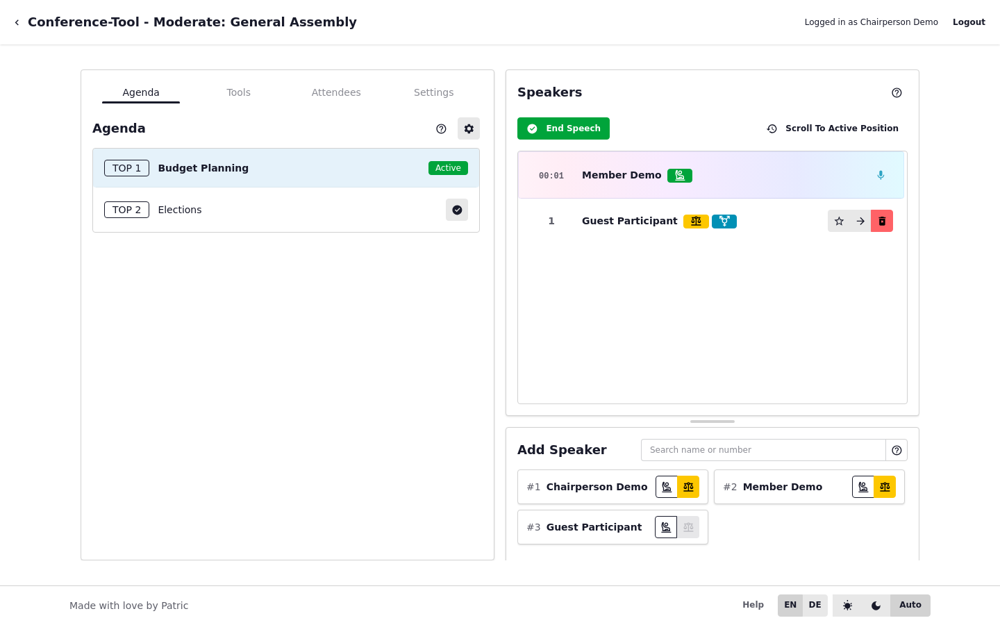

# Moderationsoberfläche im Überblick

## Hauptroute

- Moderationsseite: `/committee/{slug}/meeting/{meeting_id}/moderate`

## Bereiche

- linke Steuerung: Tabs für Tagesordnung, Tools, Teilnehmende, Einstellungen
- zentrale/rechte Panels: Redeliste, Schnellaktionen, Abstimmungsbereich
- SSE-Updates: `/committee/{slug}/meeting/{meeting_id}/moderate/stream`

## Erwartung im Betrieb

Die Moderationsseite ist der zentrale Ort für Live-Aktionen mit HTMX-Teilupdates.
