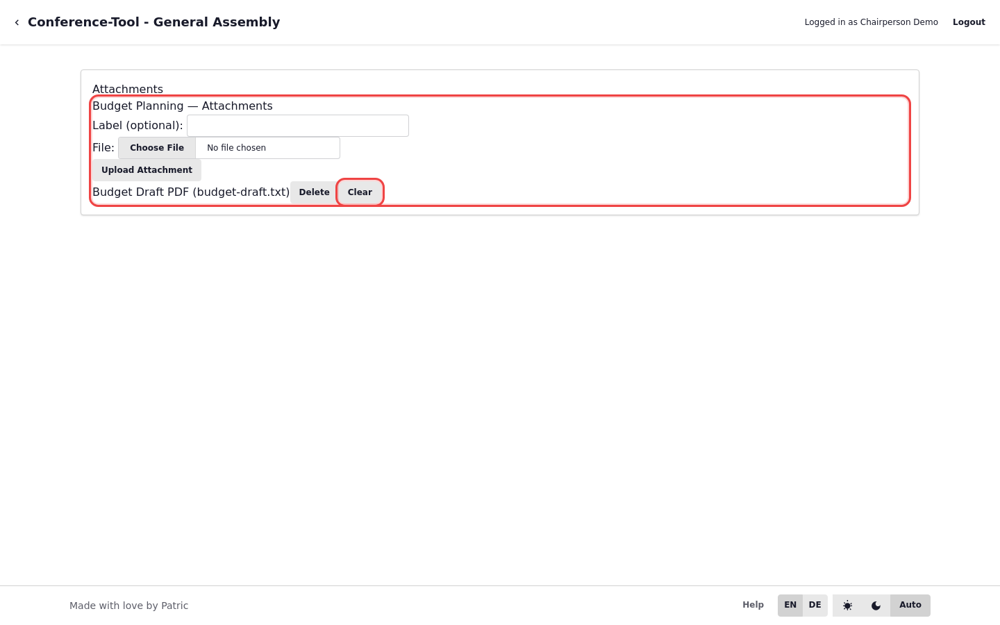

# Attachments and Current Document

Attachments support each agenda point. The current document is what attendees should read now.

## Recommended Workflow

1. Upload agenda-specific files with clear labels.
2. Set one current document for the active discussion.
3. Change or clear current document when moving topics.

## Communication Tip

Before opening discussion, tell attendees to refresh their live view if you just switched the current document.
