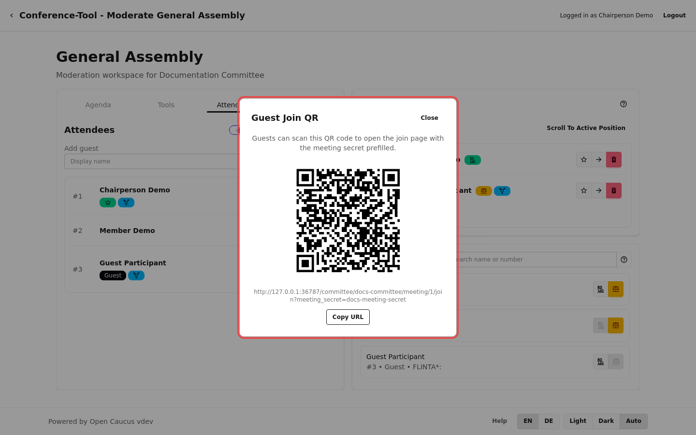

# Join QR and Access Hand-Off

Use these tools to help people join quickly and to restore access for guests who lost their login.

## Who this is for

Chairpersons handling participant onboarding during a live meeting.

## Before you start

1. Open the meeting moderation page.
2. In **Attendees**, confirm guest signup is enabled when new guests should join.
3. Decide which case you need:
   - new guest joining now
   - existing guest who lost access

## Layout on desktop vs mobile

- Desktop:
  Join QR and recovery dialogs open over the moderation page so you stay in context.
- Mobile:
  Dialogs fill most of the screen. Close the dialog when done to return to moderation.

## New Guest Join via QR

### Step-by-step

1. In **Attendees**, click **Show signup QR**.
2. A dialog opens with the QR code and join link. Use either:
   - **Copy URL** to copy the join link to your clipboard, or
   - the QR code image for guests to scan.
3. Ask the guest to open it and complete guest signup.
4. Confirm the guest appears in the attendee list.

### What the guest should experience

1. The join page opens with the meeting secret already filled.
2. The guest enters a display name and signs up.
3. The guest receives access to the live meeting page.

## Access Hand-Off for a Returning Guest

Use this when a guest was already in the meeting but lost access (for example after closing the browser).

### Step-by-step

1. In the attendee list, find the guest and click **Recovery link**.
2. A dialog opens with the recovery QR code and link. Use either:
   - **Copy URL** to copy the recovery link to your clipboard, or
   - the QR code image for the guest to scan.
3. Ask the same guest to open it directly.
4. Confirm the guest returns to the live page under the same attendee identity.

## If something goes wrong

- Guest cannot join from QR:
  Check whether guest signup is currently enabled.
- Join page asks for extra info unexpectedly:
  Re-open **Show signup QR** and share the fresh link/QR.
- Recovery does not work:
  Open a new recovery link from the attendee row and share that one.
- Wrong person received a recovery link:
  Treat recovery links as private and resend only to the correct guest.
- Mobile sharing is slow:
  Share one link/QR at a time, then return to moderation.

## What happens next

Continue with [Member Join Flow](/docs/04-members-attendees/01-member-join-flow) and [Guest Signup and Attendee Login](/docs/04-members-attendees/02-guest-signup-and-attendee-login).
