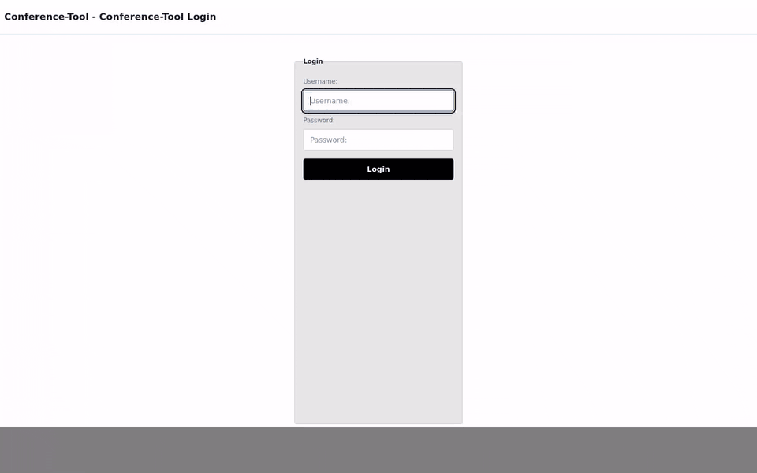

# Member Join Flow

## Flow

1. Member logs in at `/`.
2. Member opens committee page `/committee/{slug}`.
3. Member clicks active meeting join button.
4. Join submit posts to `/committee/{slug}/meeting/{meeting_id}/join`.
5. Successful signup redirects to live page `/committee/{slug}/meeting/{meeting_id}`.

## Not allowed behavior

- Members cannot join inactive meetings via active-meeting shortcut.
- Joining without committee membership is blocked by `committee_access` middleware.
