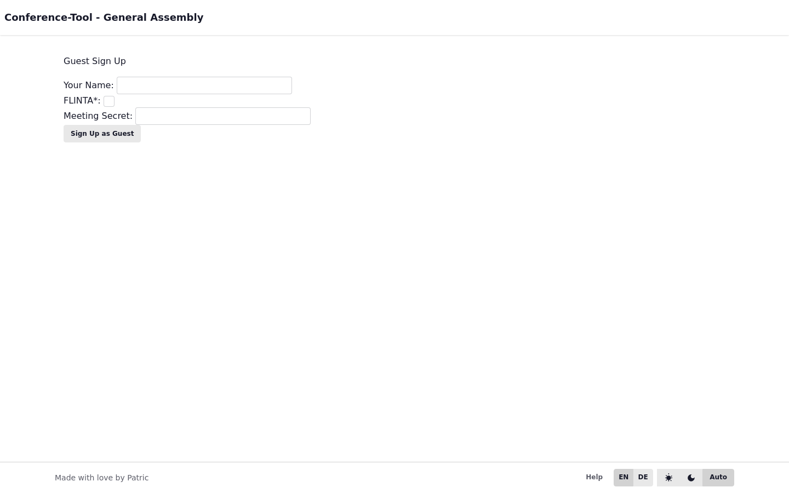
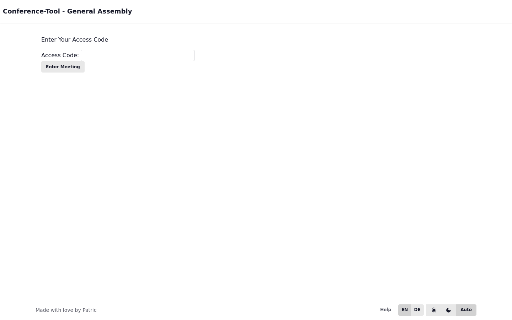

# Gast-Signup und Attendee-Login

## Gastablauf

- Join-Seite öffnen: `GET /committee/{slug}/meeting/{meeting_id}/join`
- Gastformular senden: `POST /committee/{slug}/meeting/{meeting_id}/guest`
- Zugangscode eingeben: `POST /committee/{slug}/meeting/{meeting_id}/attendee-login`

## Recovery und Sicherheit

- Zugangscode nur für das zugehörige Meeting verwenden.
- Bei Verlust Recovery-Link/QR über die Sitzungsleitung nutzen.
