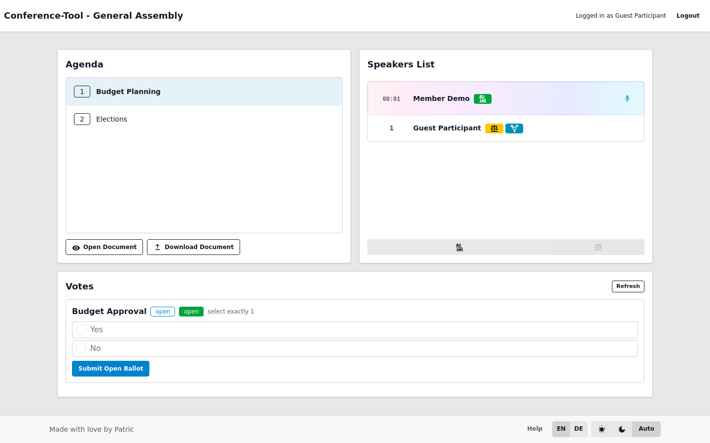

# Live Page Self-Service and Voting

## Self-service speaker actions

- Add self as speaker: `POST /committee/{slug}/meeting/{meeting_id}/speaker/self-add`
- Yield own speech: `POST /committee/{slug}/meeting/{meeting_id}/speaker/self-yield`

## Live vote actions

- Refresh live panel: `GET /committee/{slug}/meeting/{meeting_id}/votes/live/partial`
- Submit open ballot: `POST /committee/{slug}/meeting/{meeting_id}/votes/{vote_id}/submit/open`
- Submit secret ballot: `POST /committee/{slug}/meeting/{meeting_id}/votes/{vote_id}/submit/secret`

## Constraints

- Closed or archived votes cannot be submitted.
- Selection count must respect vote min/max limits.
