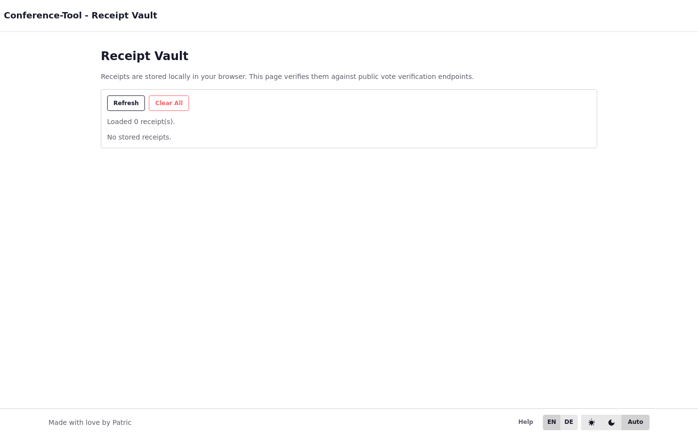

# Receipts Vault and Receipt Verification

Use this page to check saved vote receipts after a vote is finished.

## Who this is for

Anyone who has vote receipts in their browser and wants to verify them.

## Before you start

1. Open the same browser profile/device where you voted.
2. Make sure the vote is already closed.
3. Open the **Receipt Vault** page.

## Layout on desktop vs mobile

- Desktop:
  Receipt list and verify actions are visible together.
- Mobile:
  Verify one receipt at a time and scroll through results.

## Verify your saved receipts

### Step-by-step

1. Click **Refresh** to load receipts saved in your browser.
2. In the receipt list, pick one entry.
3. Click **Verify**.
4. Read the result message:
   - open vote receipts show the counted choice labels
   - secret vote receipts show confirmation that the receipt exists
5. Repeat for other receipts as needed.

### What you should see

- Each receipt card shows vote name/type and a verify result area.
- Successful checks show an `OK` result.
- Errors show a clear failure message.

## Clear local receipt storage

1. Click **Clear All**.
2. Confirm the list is empty after refresh.

Use this only if you intentionally want to remove local receipt history from this browser.

## If something goes wrong

- No receipts are shown:
  You may be in a different browser/profile than the one used for voting.
- Verification fails:
  Check that the vote is already closed and try again.
- Secret vote verification does not show choice labels:
  This is expected; secret receipts confirm participation, not public choice display.
- You cleared receipts by mistake:
  Local receipts cannot be restored from this page.

## What happens next

Return to [Public Verification](/docs/05-public-verification/) or continue with [Troubleshooting and Recovery](/docs/06-operations/02-troubleshooting-and-recovery).
