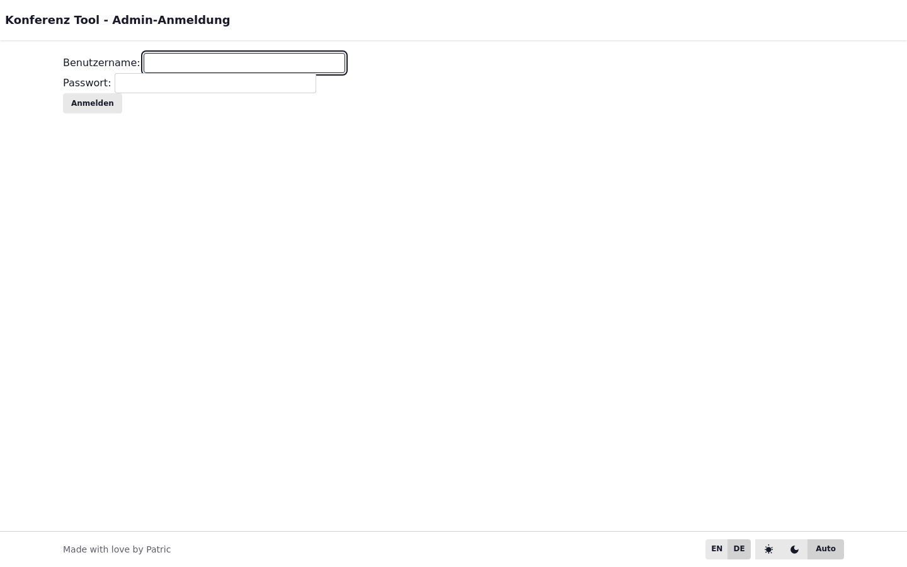
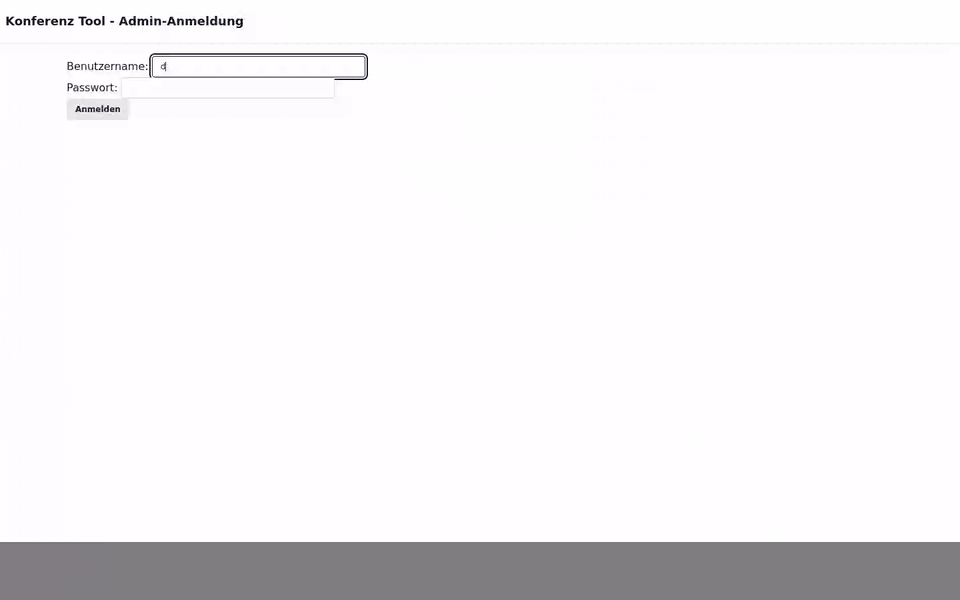

# Capture-Guide

Diese Seite erklärt, wie Dokumentations-Medien erzeugt werden.

## Screenshots

Führen Sie den docs-capture Befehl aus und wählen Sie Scripts per Glob.

## GIFs

Die GIF-Erzeugung nutzt ffmpeg und gifsicle für starke Komprimierung.

