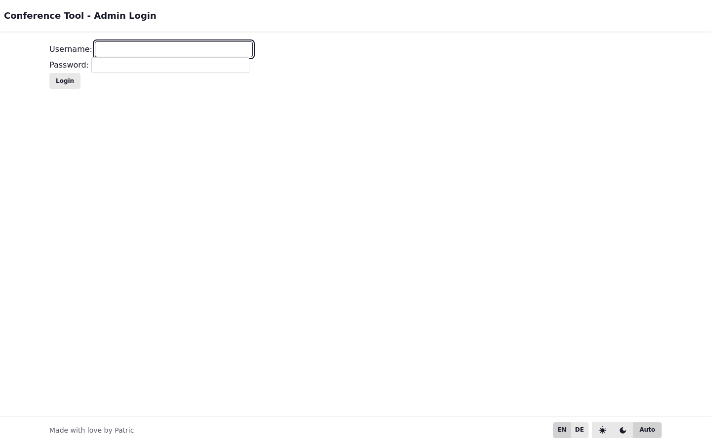
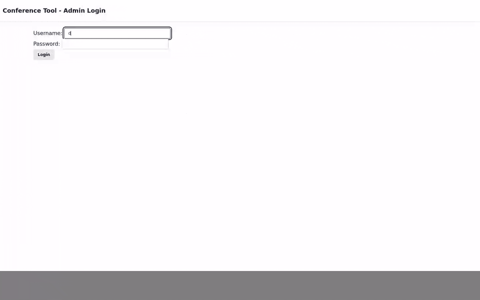

# Capture Guide

This page explains how documentation media is generated.

## Screenshots

Run the docs capture command and choose scripts by glob.

## GIFs

GIF generation uses ffmpeg and gifsicle for stronger compression.

